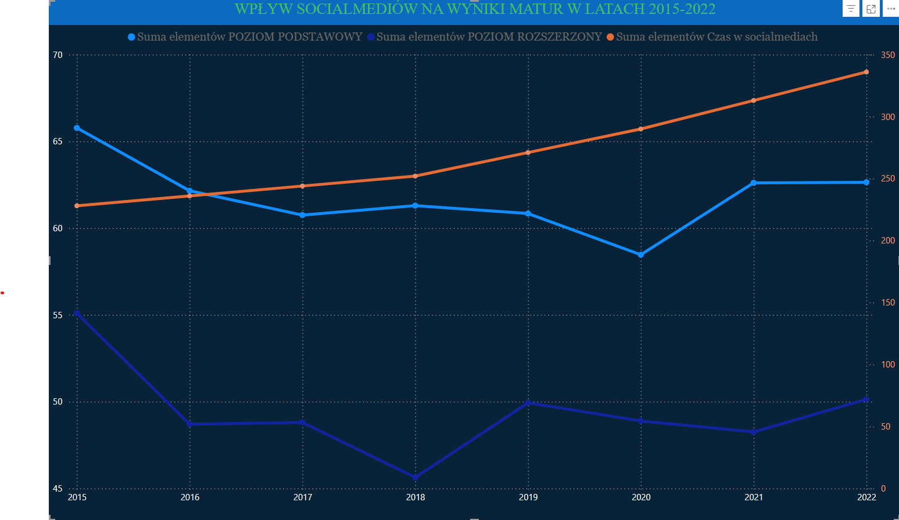

# 📊 Analiza wpływu czasu spędzanego w mediach społecznościowych na wyniki matur (2015-2022)





## Opis projektu

Celem projektu jest analiza potencjalnego wpływu czasu spędzanego przez młodzież w mediach społecznościowych na wyniki egzaminów maturalnych w latach 2015-2022. Wykorzystano dane dotyczące wyników matur oraz raporty NASK na temat aktywności młodzieży w internecie.

Analiza została przeprowadzona przy użyciu **Python (pandas, matplotlib, seaborn, scipy)**, **MySQL**, a finalne wizualizacje wykonano w **Power BI**.


---

## 📂 Struktura plików

Analiza socialmedia/  
    │── 📁 data/  
        │── Analiza trendu social_media_NASK.png  
        │── podgląd_danych.png    
        │── srednie_wyniki_egzaminu_maturalnego.csv  
        │── wszystkie.png  
    │── 📁 sql\powerbi_screenshots/  
        │── 1.png - 12.png # Kolejne etapy analizy i raportów Power BI  
    │── **analia_wpływu_socialmedia.ipynb** # Jupyter Notebook z analizą w Python  
    │── matura_analysis.db # Baza danych SQLite z wynikami matur  
    │── SQL.ipynb # Notebook SQL zawierający zapytania do MySQL  
    │── README.md # Dokumentacja projektu  
    |-- requirements.txt # zależności  
    |-- ANALIZA.pdf # **OPIS, ANALIZA ORAZ WNIOSKI W FORMACIE PDF**

---

## 📊 Źródła danych

- **Wyniki matur**: Główny Urząd Statystyczny (GUS) oraz Centralna Komisja Egzaminacyjna (CKE) - [GUS](https://stat.gov.pl/obszary-tematyczne/edukacja/edukacja/srednie-wyniki-egzaminu-maturalnego,17,1.html)
- **Czas spędzany w mediach społecznościowych**: Raporty NASK, cykl badań "Nastolatki 3.0" - [NASK](https://nask.pl/magazyn/nastolatki-3-0-raport-z-ogolnopolskiego-badania-uczniow-i-rodzicow/)


---

## 🛠 Użyte technologie
- **Python**: pandas, seaborn, matplotlib, scipy
- **SQL**: MySQL Workbench, SQLite
- **Power BI**: Wizualizacja i analiza trendów

---

## 🔎 Proces analizy
1. **Eksploracja danych**  
   - Pobranie danych GUS i NASK.
   - Wstępne czyszczenie i eksploracja (screeny w `sql/`).

2. **Przetwarzanie danych w SQL**  
   - Tworzenie bazy danych w MySQL.
   - Czyszczenie, transformacja i agregacja wyników.

3. **Analiza statystyczna w Python**  
   - Obliczenie średnich wyników matur.
   - Korelacja między wynikami matur a czasem w mediach społecznościowych.
   - Wizualizacje trendów (`analiza_wpływu_socialmedia.ipynb`).

4. **Wizualizacje w Power BI**  
   - Tworzenie interaktywnych dashboardów.
   - Analiza trendów z podziałem na przedmioty i poziomy (`sql/powerbi_screenshots/`).

---

## 📈 Wyniki analizy
- Zaobserwowano ogólny trend spadku wyników matur w czasie.
- Czas spędzany w mediach społecznościowych systematycznie wzrasta.
- Analiza korelacji wykazała niewielką, ale negatywną korelację pomiędzy tymi zmiennymi.
- Pandemia COVID-19 miała wpływ na wyniki matur, szczególnie w latach 2020-2021.

---

## 🔄 Jak uruchomić projekt?
### 📥 Pobranie repozytorium
```bash
git clone https://github.com/quantum-void-57/wplyw_socialmedia_na_wyniki_matur.git
cd analiza socialmedia
pip install -r requirements.txt
